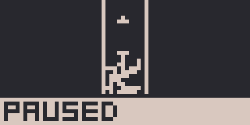
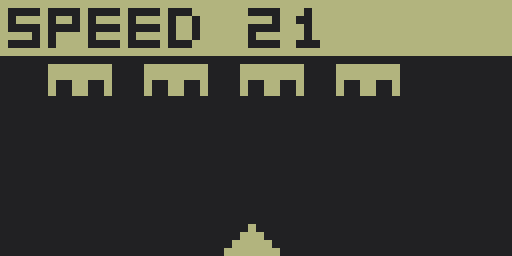

# PITCH1002

A simple CHIP-8 emulator (or interpreter, if you like)

*(tested only on linux)*

## Features

- Costs 0.00$
- Custom and builtin palettes
- Pausing and changing the game speed
- Fast forward
- Sounds! (biiip, buzzz)
- Fast, because rust (yeah!)
- "FERRIS. THE GAME" is included! FOR FREE!

## Usage

```
pitch1002 <GAME.ch8> [OPTIONS]
pitch1002 ./roms/ferris.ch8 --speed 30 --palettes #fff,#111
```

## Buttons

```
     QWERTY                  CHIP─8     
┌───┬───┬───┬───┐      ┌───┬───┬───┬───┐
│ 1 │ 2 │ 3 │ 4 │      │ 1 │ 2 │ 3 │ C │
├───┼───┼───┼───┤      ├───┼───┼───┼───┤
│ q │ W │ e │ r │      │ 4 │ 5 │ 6 │ D │
├───┼───┼───┼───┤  ->  ├───┼───┼───┼───┤
│ A │ S │ D │ f │      │ 7 │ 8 │ 9 │ E │
├───┼───┼───┼───┤      ├───┼───┼───┼───┤
│ z │ x │ c │ v │      │ A │ 0 │ B │ F │
└───┴───┴───┴───┘      └───┴───┴───┴───┘

┌─────┐
│ ESC │       - Pause/unpause the game
├───┬─┘
│ M │         - Mute/unmute
├───┼───┐
│ [ │ ] │     - Previous/next palette
├───┼───┼───┐
│ 0 │ - │ + │ - Reset/-/+ speed
├───┴───┴───┤
│   SPACE   │ - Fast forward!
├───────────┤
│   ENTER   │ (during the pause) - Restart the game
└───────────┘
```

## Building

Run:
```
cargo run -- ./roms/ferris.ch8 --speed 10
```

Build and use:
```
cargo build --release
cp ./target/release/pitch1002 .
```

## Screenshots





## License

MIT license\
You can do whatever you want with this project!
